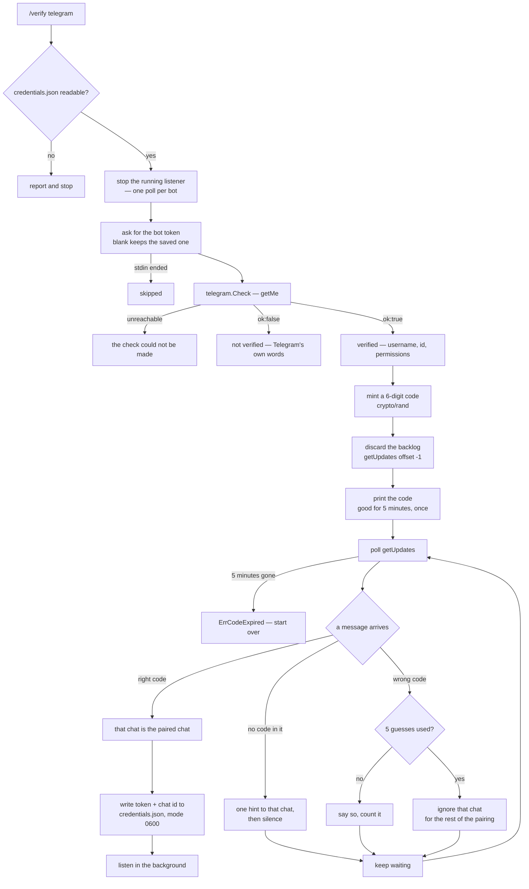

# Telegram

One thing lives here: a pairing that hands the agent to one Telegram chat, so
requests can arrive from a phone while the agent runs on this machine. It opens
with a credential check, but that check is a step in the pairing rather than a
command of its own.

- https://core.telegram.org/bots/api#getme
- https://core.telegram.org/bots/api#getupdates
- https://core.telegram.org/bots/api#sendmessage
- https://core.telegram.org/bots/features#botfather

## `/verify telegram`

Everything above the code is the check; everything below it is what only
Telegram does. The split is `report` in `cli/cli.verify.go`, which GitHub shares
and stops at.

## The check

`GET {api}/bot<token>/getMe`, the call the Bot API provides for exactly this
question. Asked for: the bot token, shaped `<id>:<secret>`. Reported from the
reply: the bot's `username`, `id`, `first_name`, `can_join_groups` and
`supports_inline_queries`. A refusal arrives as `ok: false` with a
`description`, quoted rather than paraphrased — Telegram explains the problem
better than a guess would.

`telegram.verifier.go` holds this: the token `Field`, `Check`, and the `Verdict`
that maps a reply onto the three outcomes. It implements no
`integrations.IVerifier`, since nothing would dispatch to one — the pairing is
the only way in — but it uses the same `Result` and `Field` types, so the CLI
reports a Telegram check exactly as it reports GitHub's.

## The pairing

The whole trust decision is the code. It is known only to whoever can see this
terminal, so the chat that sends it back is the chat sitting at this machine. A
stranger who finds the bot can message it but cannot know the code.

What keeps it from being brute-forced: the code lives five minutes, is good
once, and a chat gets five wrong guesses before it is ignored for the rest of
the pairing. Before pairing, `/verify` is the only thing the bot answers, and an
unpaired chat that sends anything else is told what to send once rather than
answered every time — a bot that always replies is a bot that can be made to
send mail for free.

Both spellings are accepted: `/verify 123456`, and a bare `123456`, which is
what someone typing on a phone actually sends.

Re-running the command re-pairs, which is how a new phone gets in. The saved
token is kept unless a new one is typed over it, since a token cannot be offered
as a prompt default without printing it.

## Listening

Long polling, not a webhook. It needs no public URL, no tunnel and no
certificate, which is the whole reason this works from a laptop. A webhook would
be less traffic at rest, and would also mean the agent is only reachable when
something in front of it is.

The gate is one comparison: `message.chat.id` against the paired id. Telegram
guarantees that field, and a stranger cannot forge it.

- Messages from any other chat are dropped in silence. A reply would confirm to
  a stranger that the bot is live and hand them a way to make this machine send
  messages; it is reported at the local terminal instead, without the text.
- The backlog is skipped on startup. Telegram holds undelivered messages for a
  day, so an agent started in the evening would otherwise run every command sent
  while it was off, in order, with nobody watching.
- The cursor moves before the work runs. A failed request is not redelivered:
  for an agent that edits files, running something twice is worse than losing
  it.
- A dropped network is retried with a widening pause. A revoked token, or a
  second poller, is not — waiting fixes neither, so the link closes and says
  which it was.

Telegram gets its own agent instance, separate from the one at the prompt. Each
keeps its own history, so a request from a phone cannot land mid-turn and
nothing in the agent has to be made safe for two goroutines. It reads better
from the far end too: the chat is its own conversation.

## The token

The Bot API puts the token in the URL path, not in a header. Two things follow.
It is escaped before it is interpolated, or a stray slash inside it changes
which method is called. And no URL or unwrapped transport error may ever be
printed: `Post "https://api.telegram.org/bot<the token>/getMe": connection
reset` is the token, written to the terminal. Every request funnels through one
method for that reason, and every error it returns has the token replaced first.

The same scrub runs on outgoing messages, because that is the one place text
leaves the machine and the agent can be asked to read files.

Replies are sent without `parse_mode`. They carry shell output, paths and code,
where an unpaired `_` or `*` is ordinary; asking Telegram to read that as
Markdown would have it refuse the message over punctuation. Text is clamped to
the API's 4096-character limit, which is refused rather than shortened if
exceeded.

## Destructive requests

Nothing here gates them separately, and that is a decision rather than an
omission. The agent's own instructions already tell it to describe a command
that would delete or overwrite and wait to be told to go ahead; over Telegram
that plays out as a message asking, and the answer is the next message. The
remote conversation keeps its own history, so that exchange works as it does at
the prompt, without a second confirmation mechanism to keep in step with the
first.

What that rests on is the pairing being sound. The paired chat can do anything
the user running the agent can do — it is a shell on this machine, reached from
a phone.
